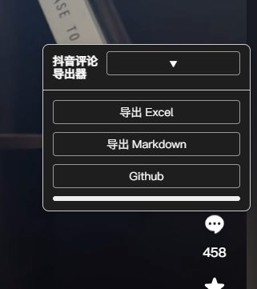

# 抖音评论导出插件 README

## 插件简介

本插件用于在抖音视频页面自动滚动加载所有评论，并支持将评论导出为 Excel 文件或 Markdown 格式文本。  
插件能自动展开所有回复，支持导出评论用户名、评论内容、时间地点及评论类型（主评论/回复）。  

## 主要功能

- 自动滚动加载抖音视频下所有评论，保证导出时评论完整；
- 自动展开所有回复，避免遗漏二级及多级评论内容；
- 支持导出为 Excel 文件（.xlsx），方便后续数据处理与分析；
- 支持导出为 Markdown 格式（.md），便于文档记录和分享；
- 导出过程中显示进度反馈，提升用户体验；
- 兼容抖音页面常见结构，适应页面动态加载和异步渲染。

## 安装方法

1. 克隆或下载本仓库到本地：git clone https://github.com/xxx/douyin-comments-export.git
2. 使用 Chrome 浏览器打开 `chrome://extensions/` 页面，开启开发者模式；
3. 点击“加载已解压的扩展程序”，选择插件代码所在文件夹；
4. 插件图标出现在浏览器工具栏，进入抖音视频页面即可使用。

## 使用说明

1. 打开任意抖音视频页面，确保评论区已展开；
2. 点击插件图标，选择“导出评论为 Excel”或“导出评论为 Markdown”；
3. 插件将自动滚动评论区，加载并展开所有回复，导出完成后自动下载文件；
4. 进度条显示当前加载和导出进度，请耐心等待完成。

## 注意事项

- 请确保网络通畅，避免加载评论失败；
- 评论数较多时加载和导出可能耗时较长，请勿关闭页面；
- Markdown 导出暂时不支持评论中图片的导出，仅支持文本和表情；
- 插件仅适用于网页版抖音评论区，移动端及其他平台暂不支持。

## 💰 支持项目

如果你觉得这个项目有帮助，请考虑赞助或请我喝杯咖啡☕：

### 🧧 扫码打赏

  
  

